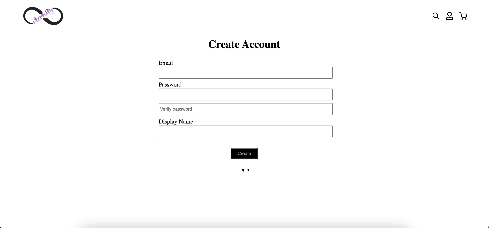
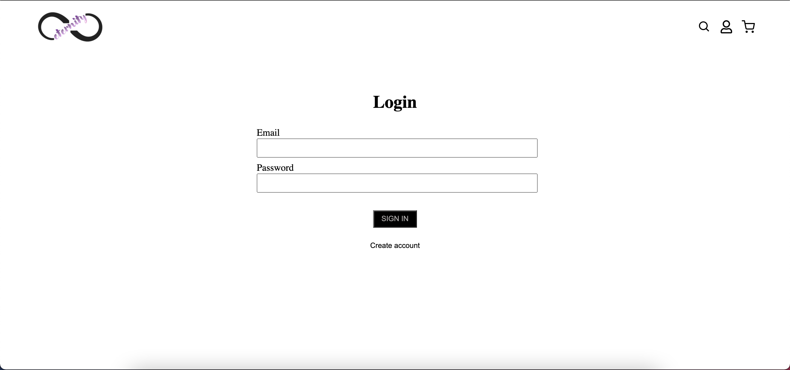
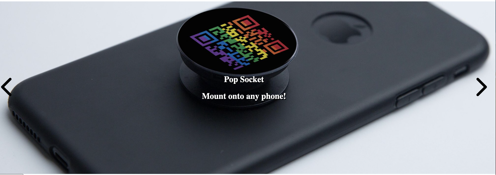

<!-- PROJECT LOGO -->
 

  
  <h3 align="center">Eternity</h3>

# Built With 
* MongoDB 
* ExpressJS 
* React 
* Node.js 
* JWT (JSON Web Token) 

# Description
>> This is a shopping site under development using MERN stack. 

### Features Complete

- #### Safe Login / Register with Error Checking using JWT

    

  

    

  

- #### Image / Products Slider 

    

 
* The image slider auto switchs the displayed image after 10 seconds, you can also manually switch between images that are stored for display by clicking the arrows

### Some Features Under Development 
- #### Adding Products through an Admin Account 
- #### Adding Products to cart and chequing out 
- #### Search Bar 

## Deployment 

### with Heroku at https://eternity-shop.herokuapp.com/

## Note: 
* use the deployed site to test. 
